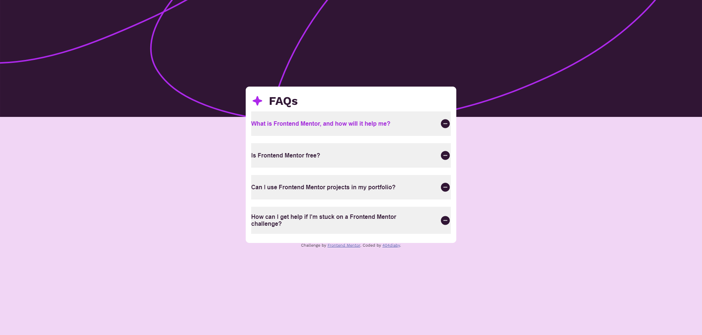
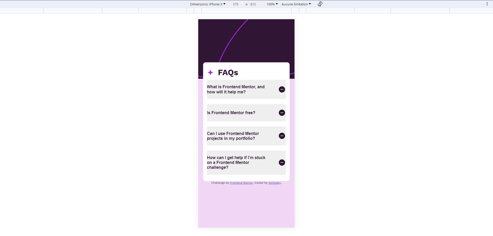

# Frontend Mentor - FAQ accordion solution

This is a solution to the [FAQ accordion challenge on Frontend Mentor](https://www.frontendmentor.io/challenges/faq-accordion-wyfFdeBwBz). Frontend Mentor challenges help you improve your coding skills by building realistic projects. 

## Table of contents

- [Overview](#overview)
  - [The challenge](#the-challenge)
  - [Screenshot](#screenshot)
  - [Links](#links)
- [My process](#my-process)
  - [Built with](#built-with)
  - [What I learned](#what-i-learned)
  - [Continued development](#continued-development)
  - [Useful resources](#useful-resources)
- [Author](#author)
- [Acknowledgments](#acknowledgments)

## Overview

### The challenge

Users should be able to:

- Hide/Show the answer to a question when the question is clicked
- Navigate the questions and hide/show answers using keyboard navigation alone
- View the optimal layout for the interface depending on their device's screen size
- See hover and focus states for all interactive elements on the page

### Design

### Screenshot

### Links

- Solution URL: [Code](https://github.com/404diaby/faq-accordion)
- Live Site URL: [live site](https://faq-accordion-ecru.vercel.app/)

## My process
- Read entire documentation for project
- Divide each component inside project into small tasks to be completed
- Work on one thing at a time
- Then worked on component shape to fit with frontendmentor design
- Followed style guides inside project for fonts and page color

### Built with

- Semantic HTML5 markup
- Flexbox
- Mobile-first workflow

### What I learned

### Continued development

Use this section to outline areas that you want to continue focusing on in future projects. These could be concepts you're still not completely comfortable with or techniques you found useful that you want to refine and perfect.
  - Mobile-first workflow

### Useful resources

- [resource 1](https://www.w3schools.com/howto/howto_js_accordion.asp) - This is an amazing article which helped me finally understand  the logic behind. I'd recommend it to anyone still learning this concept.

## Author

- Website - [Diaby Mamadou](https://diaby-mamadou.vercel.app/)
- Frontend Mentor - [@404diaby](https://www.frontendmentor.io/profile/404diaby)
- Twitter - [@404diaby](https://twitter.com/404diaby)
- Github - [@404diaby](https://github.com/404diaby)

## Acknowledgments

This is where you can give a hat tip to anyone who helped you out on this project. Perhaps you worked in a team or got some inspiration from someone else's solution. This is the perfect place to give them some credit.

